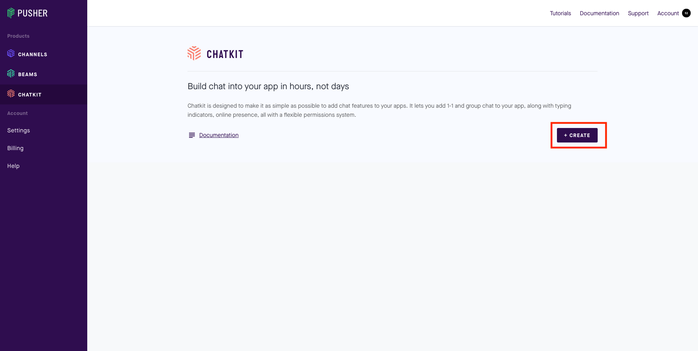
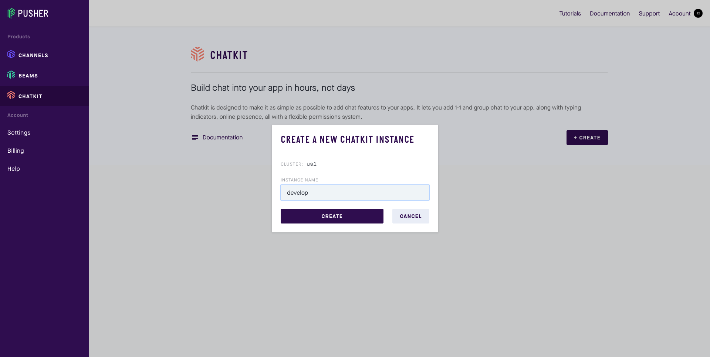
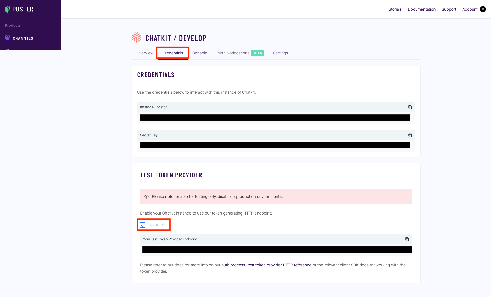

# chatkit-sandbox

Pusher Chatkitの検証用リポジトリ

## Pusher Chatkit

https://pusher.com/chatkit

チャット基盤を提供しているサービスで、

* 1 on 1のチャット
* グループチャット
* 画像などのメディア送受信
* チャットの履歴保存
* モバイル・WEBプッシュ通知
* オンライン・オフラインの確認

などチャットおよび、付加機能を多く提供している。


## 参考資料

* https://www.sitepoint.com/pusher-vue-real-time-chat-app/
* https://github.com/pusher/chatkit-server-node/tree/master/examples


## 環境構築

### Chatkitの登録

Chatkitに登録し、インスタンスを作成してください。





「Credentials」を開き、『Instance Locator』『Secret Key』『Your Test Token Provdider Endpoint』の値を控えておいてください。  
初期状態は『Your Test Token Provdider Endpoint』は存在しないので、「ENABLED?」にチェックをつけてください。  



### 環境変数の設定

当プロジェクトの直下で以下の環境変数をexportしてください。  
`direnv`の利用を想定しています。

```
CHATKIT_INSTANCE_LOCATOR=[your instance locator]
CHATKIT_PRIVATE_KEY=[your instance private key]
CHATKIT_TEST_TOKEN_PROVIDER_ENDPOINT=[your instance test token provider endpoint]
TOKEN_PROVIDER_URL=/auth/token
```

もしDockerコンテナではなく、ローカルマシン上で直接 auth-server, chat-app を動かしたい場合は、
各プロジェクト配下に環境変数をexportしてください。

* auth-server

```
CHATKIT_INSTANCE_LOCATOR=[your instance locator]
CHATKIT_PRIVATE_KEY=[your instance private key]
CHATKIT_TEST_TOKEN_PROVIDER_ENDPOINT=[your instance test token provider endpoint]
```

* chat-app

```
CHATKIT_INSTANCE_LOCATOR=[your instance locator]
TOKEN_PROVIDER_URL=/auth/token
```

